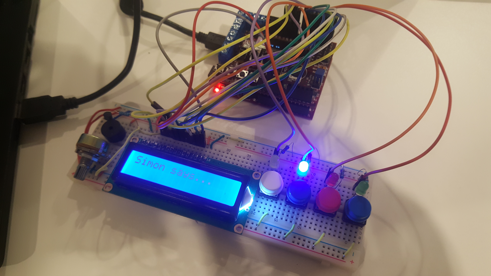

## Simon Says ChipKIT
#### A univeristy project developed for the PIC32 microprocessor ChipKIT board.

This project is a interactive game inspired by the classical "Simon Says". Simon says a color and the player has to repeat the pattern that is given to them by pressing the buttons on the breadboard. If the player fail to do so it's game over.

The game program is built upon different components which are using different kinds of protocols and configurations of the available ports on the board:

##### EEPROM
To store highscores, the program flash is writing to the non-volatile EEPROM memory present on the ChipKIT I/O shield. This is done by using the I2C protocol where a specific set of instructions are sent through the I2C bus to the EEPROM chip for reading or writing.

##### LCD display
A custom parallel interface is used for the LCD display. Bytes are sent to the display with some delay in between in a certain order for initializing and configuring things like font size and number of lines. Once initialized, instructions for moving the cursor and printing characters can be made one byte at a time.

##### Interrupts
For fair gameplay and for configuring the display, timers and interrupts are used to trigger functions or to wait until a delay have passed independent of the processor speed.

##### Buzzer
To generate sound a passive buzzer is used together with the PWM (Pulse Width Modulation) pins on the ChipKIT to generate a buzz with different frequencies depending on the color picked in the game.

##### Helpers
Configuring the memory mapped I/O ports on the processor is done with the help of the pic32mx header file where ports are easily set with macros. This together with the helper functions using these macros makes it really simple to add complex logic for inputting and outputting data.

##### Game
The game is built on states and loops, one infinite loop for immidiate change `update()` and one for updating game ticks `fixedUpdate()` which is triggered by the timer interrupt.
